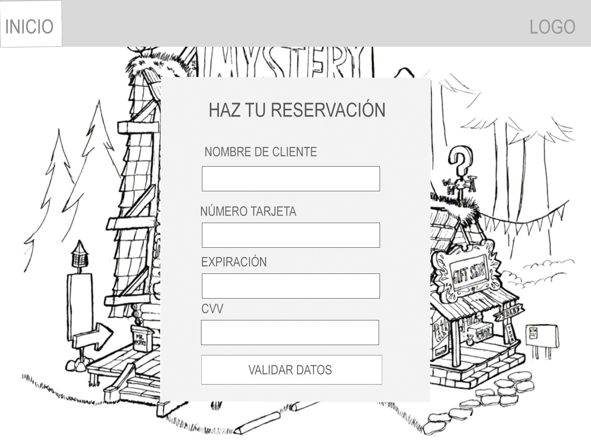
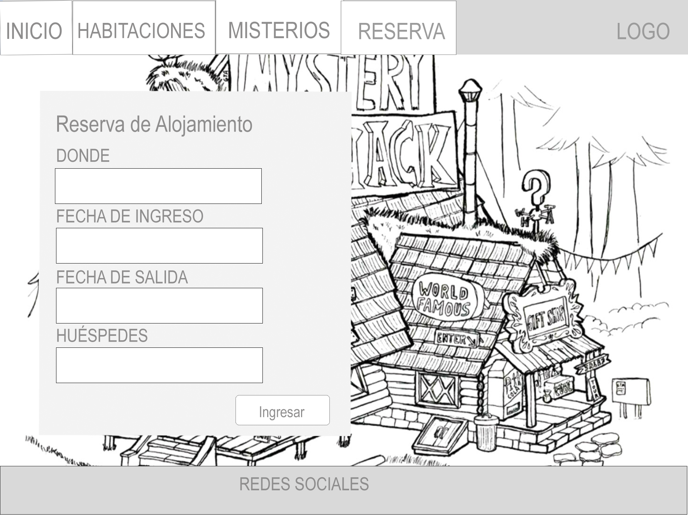
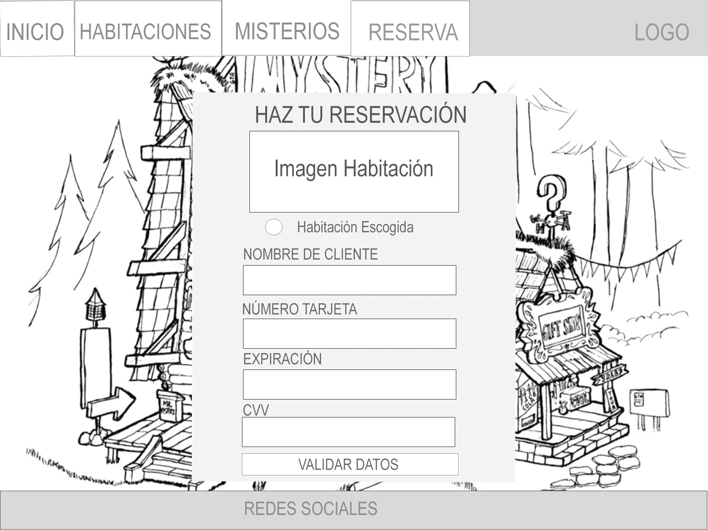
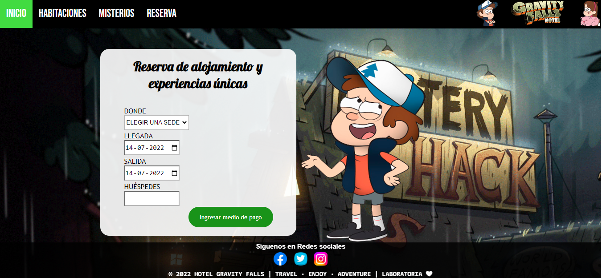
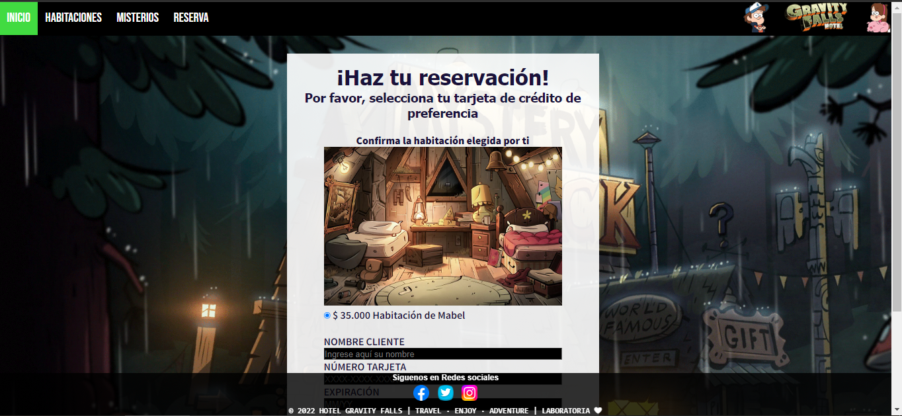
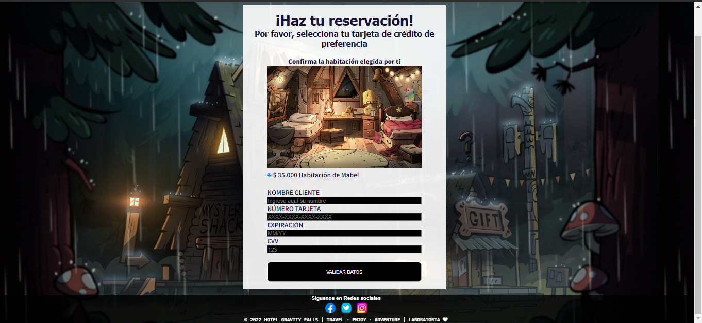

<!--Debe contener lo siguiente:
* Un título con el nombre de tu proyecto.
* Un resumen de 1 o 2 líneas de qué se trata tu proyecto.
* La imagen final de tu proyecto.
* Investigación UX:
  1. Explicar quiénes son los usuarios y los objetivos en relación con el
    producto.
  2. Explicar cómo el producto soluciona los problemas/necesidades de dichos
    usuarios.
  3. Luego colocarás la foto de tu primer prototipo en papel.
  4. Agregar un resumen del feedback recibido indicando las mejoras a realizar.
  5. Imagen del prototipo final. -->
  
# Bienvenidxs a Hotel Gravity Falls :evergreen_tree:  - *Card Validator*
Este es el ***primer hotel temático de una de las series más exitosas de la televisión*** :sparkles:, donde las familias chilenas podrán realizar diferentes reservaciones, conocer misterios y validar la tarjeta de crédito para gestionar su reservación
## Índice
* [1. Usuarixs y objetivos de este proyecto](#1-usuarixs-proyecto)
* [2. Solución a los problemas de los usuarios:ok_person:](#2-solucion-usuarios)
* [3. Primer prototipo ](#3-primer-prototipo)
* [4. Feedback ](#4-feedback)
* [4. Prototipo Final ](#5-prototipo-final)

***
### 1. Usuarixs y objetivos de este proyecto
¡Un hotel diseñado especialmente para entretener a la *familia*:family:, con especial importancia en los más pequeñitos del hogar! Esta ubicado en la ciudad de La Serena donde los huéspedes podrán disfrutar de un ambiente lleno de misterio con una exquisita mezcla de diversión y entretención para todo tipo de familias. 

El objetivo objetivo principal es ofrecer el mejor servicio desde el primer momento, impresionando a cada usuario que nos visite desde nuestra página web temática, satisfaciendo las necesidades del mercado y superando las expectativas de los clientes con un hotel único y exclusivo.

### 2. Solución a los problemas de los usuarios:ok_person:
Esta página web da solución a un mercado con demanda especializada en donde los clientes cada vez son más exigientes. De esta forma, se crea oportunidades entre la oferta de alojamientos turísticos. Nuestra página web permite validar la tarjeta de crédito del titular utilizando un método de pago más seguro para el cliente y garantizando el pago de sus reservaciones.
 
 ### 3. Primer prototipo  

### 4. Feedback recibido :revolving_hearts:
* Agregar una página de inicio
  * Mejorar algunas líneas del CSS

### 5. Prototipo Final

## Reservación

 # Proyecto Final :exploding_head:
 ## Inicio de la página :star:		
 

 ## Reserva :star:	
 
 

